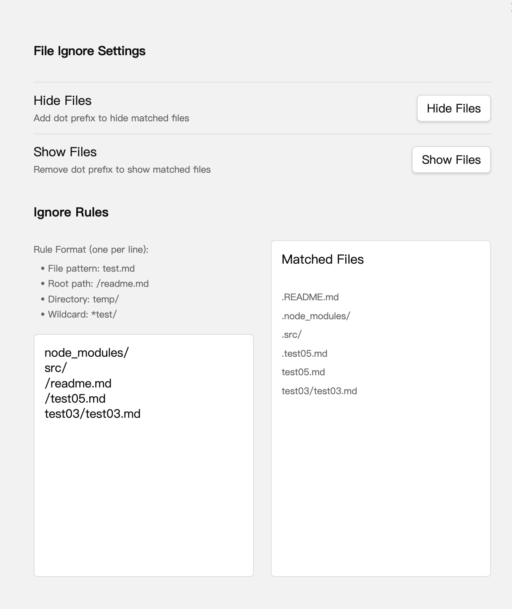

# 📁 File Ignore

An Obsidian plugin that controls file indexing by managing dot prefixes (hidden attributes) on files/folders, providing a `.gitignore`-like experience.
obsidian-file-ignore.kkuk.dev

English | [简体中文](README-zh.md)

## Motivation

- I use Next.js to manage my blog, writing and publishing through Obsidian. However, `/node_modules` was a headache as Obsidian indexed everything, causing extremely slow startup.
- Leveraging Obsidian's default behavior of not indexing "dot-prefixed hidden files", I developed this plugin to change indexing behavior by modifying file names.
- Before using the plugin, opening the repository took about 10s; after using it, it opens almost instantly.

### Related Scenarios

When your Obsidian vault contains numerous non-note files (like code repositories, attachments, caches):

*   🐢 **Slow Startup & Performance Bottlenecks**: Obsidian tries to index all files (including `node_modules`, `.git`, large attachment folders), leading to long startup times, high RAM and CPU usage, and sluggish operations.
*   🔍 **Cluttered Workspace**: Global search results get polluted by irrelevant content from `node_modules`, etc.; the graph view becomes crowded and hard to read due to numerous non-note files.
*   ⚙️ **Limited Built-in Exclusion**: Obsidian's built-in "Exclude files" option often fails to truly prevent performance hits from indexing and isn't convenient to configure.

---

## 🚀 Features

*   **File Filtering**: Specify files or folders to ignore based on rules.
*   **Hide Files**: Add a dot (.) prefix to matched files/folders, making them invisible to Obsidian.
*   **Show Files**: Remove the previously added dot prefix, restoring visibility.
*   **.gitignore-Style Patterns**: Use familiar patterns for configuration.
*   **Index Control**: Prevent Obsidian from indexing and processing irrelevant content.

## ⚙️ Usage

### Matching Rules

Supports the following matching patterns:

- Specific file: `test.md`
- Root directory file: `/readme.md`
- Entire folder: `temp/`
- Wildcard matching: `*test/` (e.g., `/_build/`, `/cache*/`)

### Operations

After configuring rules in the plugin settings page, you can:

- Click **"Hide Files"**: Builds a rename plan, shows a preview, and then adds a "." prefix to matching files/folders.
- Click **"Show Files"**: Builds a rename plan, shows a preview, and then removes the "." prefix from matching files/folders.
- If a batch is interrupted, use the **Recovery** action in settings to undo the already-completed part safely.

### How to Configure?
Configure your ignore rules in Obsidian's `Settings` -> `Community plugins` -> `File Ignore` settings page.

## 🛠️ Installation

1.  Open `Settings` > `Community plugins` in Obsidian.
2.  Ensure `Safe mode` is **off**.
3.  Click `Browse community plugins`.
4.  Search for "File Ignore".
5.  Click `Install`.
6.  Once installed, click `Enable`.

## 🔍 Tips

Recommended to use with the [Show-Hide-Files](https://github.com/polyipseity/obsidian-show-hidden-files) plugin for better management (viewing or manipulating) of files hidden by this plugin.

## 🔒 Safety Notes

- **Important:** File Ignore works by renaming files and folders on disk. It is not a native Obsidian exclude API.
- Hide/Show now builds a rename plan before execution and skips protected areas such as `.obsidian/`, `.git/`, and `.trash/` automatically.
- When the destination name already exists (for example, both `foo.md` and `.foo.md` are present), the plugin aborts the rename and emits an audit log instead of overwriting either file.
- Nested children are skipped when their parent directory is already scheduled for renaming, which avoids double-processing the same subtree.
- The latest batch is persisted so interrupted runs can be undone from the settings page.
- Each rename records a `[file-ignore][audit]` line in the developer console, making it easy to trace which paths were changed if something looks wrong.

## 🧪 Debugging & Troubleshooting

1. Open `Settings → Community plugins → File Ignore`.
2. Enable **Debug logging** to stream detailed diagnostics.
3. Use `View → Toggle Developer Tools` and inspect the **Console** tab; look for `[file-ignore][audit]` entries detailing hide/show batches, skipped items, and failures.
4. Disable the toggle after finishing—normal operation stays quiet unless a warning or error occurs.

## 🤝 Support

If you encounter any issues or have suggestions for improvements, please visit our [GitHub repository](https://github.com/Feng6611/Obsidian-File-Ignore) to create an issue.

You can also support me by buying me a coffee: [Buy Me A Coffee](https://buymeacoffee.com/RDzWpfRwLU)

## 📄 License

This project is open-sourced under the MIT License - see the [LICENSE](LICENSE) file for details.
