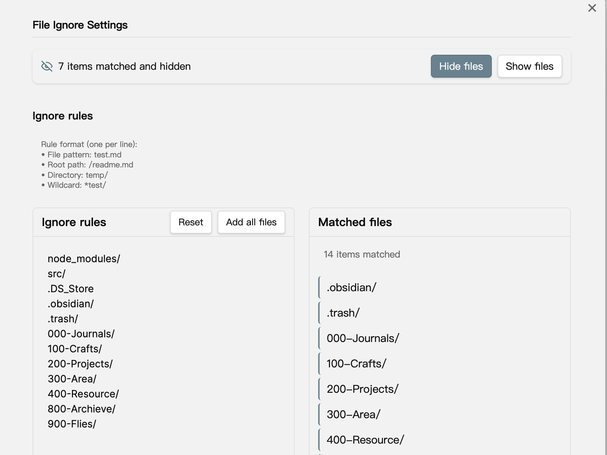

# 📁 File Ignore

An Obsidian plugin that controls file indexing by managing dot prefixes (hidden attributes), providing a .gitignore-like experience.

English | [简体中文](README-zh.md)

## 💡 Background

When using Obsidian to manage repositories with numerous files (like Next.js projects), you might encounter these issues:

- Obsidian indexes all files (including node_modules), resulting in extremely slow startup
- Lack of file filtering mechanism similar to .gitignore
- Manual management of hidden files is tedious and error-prone

This plugin leverages Obsidian's default behavior of not indexing "dot-prefixed hidden files" to provide a simple file filtering solution. Tests show startup time improvement from 10s to near-instant.

## ⚡️ Usage

### Matching Rules

Supports the following matching patterns:

- Specific file: `test.md`
- Root directory file: `/readme.md`
- Entire folder: `temp/`
- Wildcard matching: `*test/`

### Operations

The plugin provides two core functions:

- "Hide Files": Add a "." prefix to matched files, setting them as hidden
- "Show Files": Remove the "." prefix from matched files, restoring them as normal files

### 🔍 Tips

Recommended to use with the [Show-Hide-Files](https://github.com/polyipseity/obsidian-show-hidden-files) plugin for better hidden file management.

## 🤝 Support

If you encounter any issues or have suggestions for improvements, please visit our [GitHub repository](https://github.com/feng6611/file-ignore) to create an issue.

## 📄 License

This project is open-sourced under the MIT License - see the [LICENSE](LICENSE) file for details.
